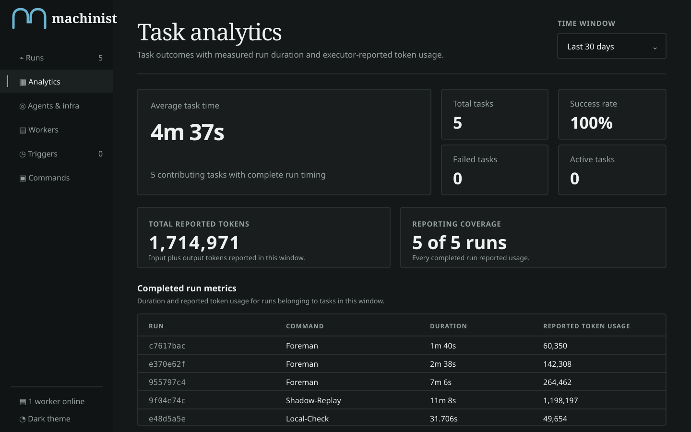
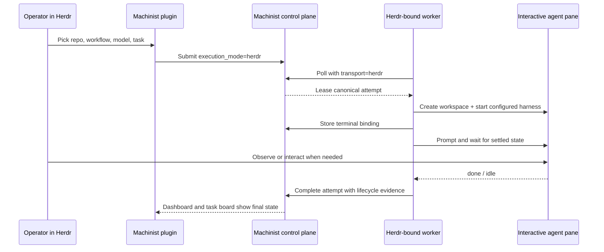
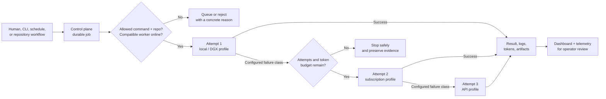
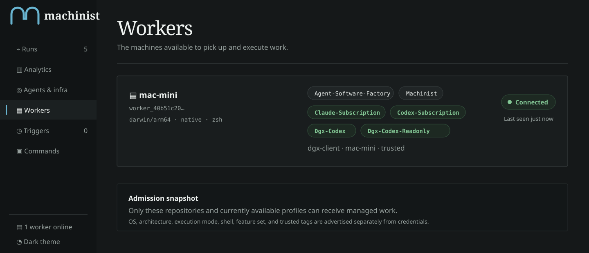
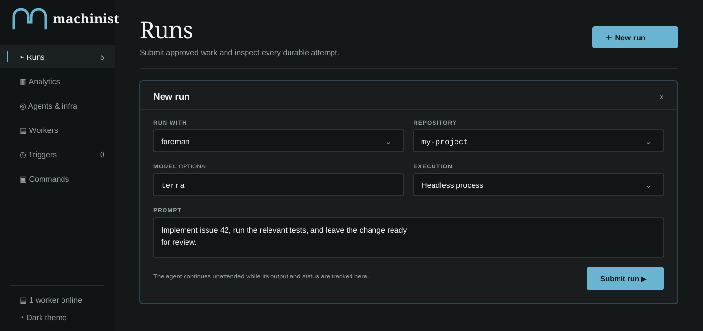
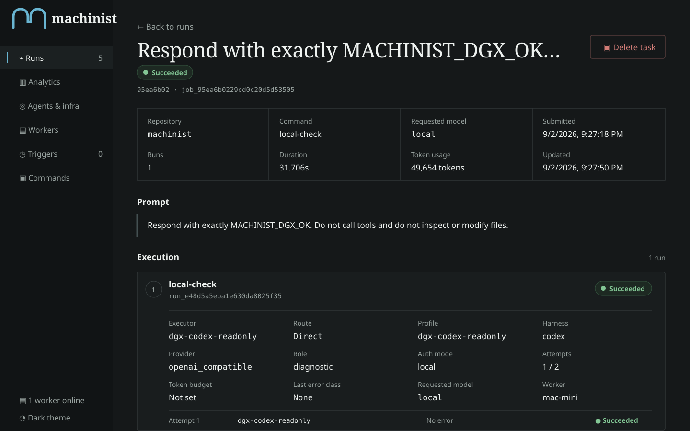
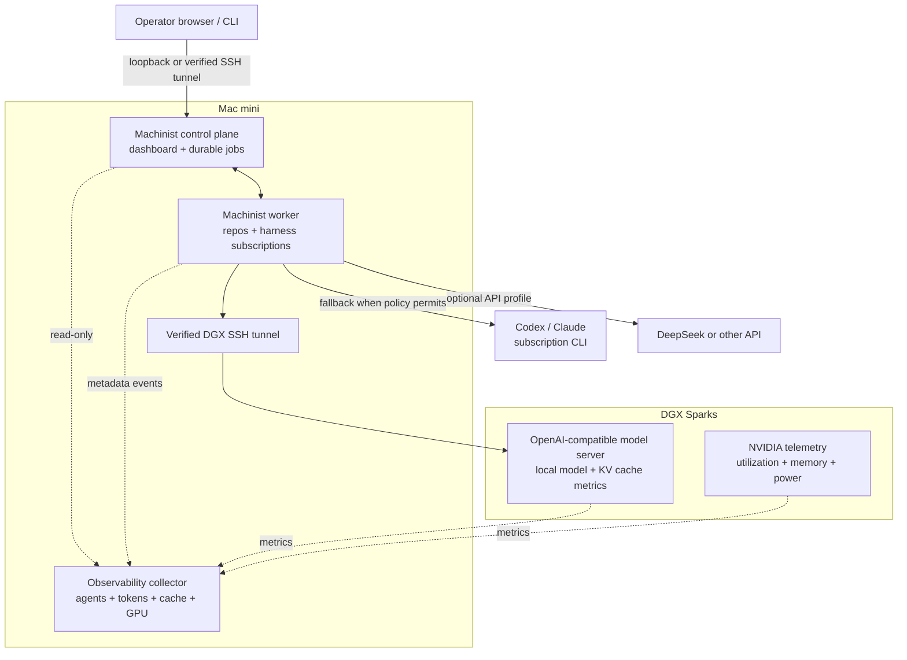

<p align="center">
  
</p>

<p align="center">
  <strong>The open source AI software factory for agentic coders.</strong><br>
 Machinist is an open source software factory for repeatable and scalable AI coding workflows. 
</p>

<p align="center">
  <a href="https://machinist.sh">Website</a> ·
  <a href="docs/README.md">Documentation</a> ·
  <a href="docs/adaptive-agent-platform.md">Adaptive platform</a> ·
  <a href="docs/configuration.md">Configuration</a> ·
  <a href="docs/herdr.md">Herdr</a> ·
  <a href="docs/observability.md">Observability</a> ·
  <a href="examples/workflows/README.md">Workflow examples</a>
</p>

<p align="center">
  
</p>

<p align="center"><sub>Machine section · supervised agent system · exploded assembly</sub></p>

Machinist is an open-source software factory implementation. It runs on your machine, keeps repository access and credentials local, and records the work from request to handoff. Commands can invoke Codex, Claude Code, another agent CLI, a test runner, a shell script, or repository-owned orchestration.

Please note: this is early access software and subject to change. 

<p align="center">
  
</p>

<p align="center"><sub>Scalable interface capture using live Mac mini deployment values. Values are deployment-specific.</sub></p>

## Adaptive agent platform

Bostonvex `main` builds on the `v0.5.0-rc.5` release candidate with an
environment-aware, multi-harness control plane and optional interactive Herdr
transport. A command can select an ordered route of worker-local profiles
instead of being coupled to one executable, model, or interaction style. This
keeps prompts, source, credentials, and subscription sessions on the execution
host while allowing the control plane to schedule and observe the work.

| Capability | What is available |
| --- | --- |
| Harness and model routing | Per-command and per-role profiles for Codex, Claude Code, OpenCode, Pi, generic executables, and bounded custom identifiers such as DeepSeek or Aider |
| Cost and authentication | Subscription-backed CLIs, API-key providers, and local inference can be ordered in the same route; secret values never enter the control-plane catalog |
| Local and DGX models | OpenAI-compatible and CLI-mediated local endpoints, including a Mac control plane using one or more DGX Sparks as dedicated inference servers |
| Environment awareness | Automatic OS, architecture, execution mode, shell, path-style, and feature discovery, plus operator-controlled trust tags and compatibility admission |
| Recovery and cost bounds | Durable fenced attempts, normalized failure classes, explicit fallback policy, attempt limits, aggregate token ceilings, cancellation, and bounded lease-loss recovery |
| Unattended operation | Scheduled and repository-owned orchestration within fixed commands, repositories, profiles, environment requirements, retry policy, and token budgets |
| Dashboard and telemetry | Work and run state, workers, routes, agents, reported tokens, prompt cache, server KV cache, model endpoints, and NVIDIA/DGX health without placing high-volume telemetry in the job database |
| Platforms | Native macOS and Linux workers plus Windows `amd64`/`arm64` workers with Job Object process-tree cancellation; release archives are produced for all six targets |
| Interactive terminal work | Optional Herdr plugin with editable agent terminals, a workflow picker, a live task board, and a durable run-to-workspace/pane binding |

The first paired shadow task completed with equivalent acceptance, one attempt,
33.4% lower elapsed time, and 66.0% fewer reported tokens than its historical
Buzz execution. That is encouraging but is only one pair: the project remains
in a staged pilot until the [cutover benchmark](benchmarks/README.md) has enough
representative tasks. See the
[Buzz/Agent Software Factory comparison](docs/buzz-asf-comparison.md),
[platform design and cutover plan](docs/adaptive-agent-platform.md), and
[first pilot report](benchmarks/pilot-2026-09-02.md) for the scope, tradeoffs,
evidence, and adoption criteria.

## Why Machinist

- **One controlled entrypoint.** Workers expose named commands and repositories, never arbitrary shell text or machine-local paths.
- **Bring your own harness.** Use any executable that accepts a prompt on standard input.
- **Keep authority local.** Repositories, credentials, model aliases, and executor configuration stay on the worker.
- **Inspect every run.** Stream output, retain durable events and artifacts, and track terminal outcomes, duration, and reported token use.
- **Bound unattended work.** Fixed catalogs, profile routes, environment requirements, retry policy, and budgets constrain scheduled or repository-owned automation.

## Choose how the agent runs

Machinist uses the same job, route, budget, and attempt model for both execution
styles. Choose per submission; changing the transport does not create a second
task system.

| Mode | Best for | Operator experience | Worker transport |
| --- | --- | --- | --- |
| Headless process | AFK implementation, audits, scheduled work, CI-style tasks | Submit and return later; inspect durable output in Machinist | `process` |
| Interactive Herdr | Exploratory work, approvals, agent questions, live steering | Watch and edit the real terminal while Machinist tracks the canonical run | `herdr` |

A Herdr job waits for a Herdr worker; it never silently runs headlessly. A
process job likewise cannot be claimed by the interactive worker.

## What you can do

### Run one supervised task

Use Machinist as a thin local wrapper around an existing agent CLI. This is the
smallest useful setup and does not require the control plane or dashboard:

```sh
machinist run \
  --command=foreman \
  --repo=/absolute/path/to/my-project \
  --model=terra \
  --prompt="Implement issue 42, run the relevant tests, and open a pull request."
```

### Route work across local, subscription, and API models

One logical `implement` command can prefer a local DGX model, use an existing
Codex subscription when local capacity is unavailable, and call DeepSeek only
for configured fallback conditions. The repository and every credential stay
on the worker.

```text
implementation route
  1. dgx-local           local inference, no per-token API charge
  2. codex-subscription  existing signed-in Codex CLI session
  3. deepseek-api        worker-local DEEPSEEK_API_KEY
```

### Leave bounded work running while you are away

Submit work through the dashboard, CLI, cron trigger, or repository-owned
orchestrator. Machinist admits only named commands and registered repositories,
selects a compatible worker, enforces the attempt and token budget, and keeps a
durable record for review. It does not accept arbitrary remote shell commands.

### Watch and steer an agent in Herdr

Install the bundled plugin, start the dedicated persistent session, and choose
**Machinist: New interactive workflow** from Herdr’s action menu:

```sh
herdr plugin link ./plugins/herdr-machinist --enabled
herdr --session machinist
```

The picker submits the same canonical Machinist job the dashboard uses. An
interactive worker inside Herdr creates a workspace at the approved repository,
starts the configured Codex, Claude, OpenCode/DeepSeek, or other supported
harness, and sends the prompt through Herdr’s agent API. You can watch the real
terminal, answer a question, approve work, edit commands, or continue the agent
conversation. Machinist retains the job, route, attempts, budgets, and exact
session/workspace/pane/agent binding; it does not record raw keystrokes.

#### Example: implement an issue with a local model and stay available to steer

Suppose `implement` uses the ordered route `dgx-codex → codex-subscription`.
Open the plugin action, choose the approved `machinist` repository, select the
`local` model alias, and paste the acceptance-focused task. The picker submits
one canonical job with `execution_mode=herdr`; it does not start an untracked
shell command.

<p align="center">
  
</p>

<p align="center"><sub>Illustrative vector walkthrough of the shipped terminal picker. Exact Herdr chrome may vary by version.</sub></p>

Machinist leases the attempt to the session-bound worker, creates the workspace
at the registered repository, starts the configured Codex adapter, and records
the terminal binding. If the agent asks whether to apply a migration, you answer
in the same pane while the worker keeps the lease alive. The adjacent task board
and web dashboard continue to show the same job and attempt.

<p align="center">
  
</p>

<p align="center"><sub>One editable agent pane, one durable Machinist run. State and binding metadata synchronize; raw terminal input does not.</sub></p>



The normal service worker advertises `process` only, while the plugin worker
advertises `herdr` only, so an interactive request cannot silently fall back to
a headless process. See the [Herdr integration guide](docs/herdr.md) for profile
examples, DGX routing, lifecycle behavior, and platform-specific operation.

### See why a run behaved the way it did

Each run records the chosen worker, environment, profile, harness, provider,
authentication mode, model alias, attempt number, normalized failure class,
duration, exit code, and reported token total. A fallback is another explicit
attempt, not an invisible replay of the full transcript.

## How a task flows



The next attempt receives only a compact handoff containing the attempt number,
budget, and previous error class. It does not inherit an ever-growing transcript,
which limits repeated context and cross-provider leakage.

<a id="quick-start"></a>

## Quick start

Get your first dashboard-tracked run working in about five minutes. You need Go
1.26.6 or newer and at least one supported agent CLI already installed and
signed in. The generated example uses Codex; substitute another configured
harness if preferred.

### 1. Build and initialize

```sh
git clone https://github.com/Bostonvex/machinist.git
cd machinist
mkdir -p ./bin && go build -o ./bin/machinist ./cmd/machinist
./bin/machinist init
```

`init` creates the control-plane and worker configuration under
`~/.machinist/`. The starter already includes the approved `foreman` command
and Codex executor. Register the checkout you want agents to use by
uncommenting and editing this block:

```toml
# ~/.machinist/worker.toml
[repositories.my-project]
path = "/absolute/path/to/my-project"
```

Machinist accepts only repository names and command names that you explicitly
configure. Run validation now; it catches missing CLIs, bad paths, and invalid
profiles before any work is submitted.

```sh
./bin/machinist worker validate
```

### 2. Start Machinist

Keep these two processes running in separate terminals:

```sh
# Terminal 1: API, durable scheduler, and dashboard.
./bin/machinist start

# Terminal 2: local harnesses, credentials, and repository access.
./bin/machinist worker start
```

Open [http://127.0.0.1:7331](http://127.0.0.1:7331). The **Workers** page should
show one online worker, the `my-project` repository, and its available model
aliases.

<p align="center">
  
</p>

<p align="center"><sub>Example worker view. Host names, repositories, profiles, and health values reflect your own machine.</sub></p>

### 3. Submit the first unattended run

Go to **Runs**, select **New run**, and choose:

1. **Run with:** `foreman`
2. **Repository:** `my-project`
3. **Model:** an advertised alias such as `terra`
4. **Execution:** `Headless process`
5. **Prompt:** a concrete task with acceptance criteria and required tests

<p align="center">
  
</p>

<p align="center"><sub>Submit a named workflow against an approved checkout; no remote shell command or machine-local path is accepted.</sub></p>

Select **Submit run**. The run page updates with its lease, attempt, worker,
streamed output, terminal state, duration, and reported token use. You can close
the browser; the control plane and worker continue the task.

Prefer a terminal-only smoke test? The direct runner does not need the server
or worker:

```sh
./bin/machinist run \
  --command=foreman \
  --repo=/absolute/path/to/my-project \
  --model=terra \
  --prompt="Implement issue 42, run the relevant tests, and leave it ready for review."
```

### 4. Optional: make the run interactive in Herdr

To enable the editable terminal workflow:

```sh
herdr plugin link ./plugins/herdr-machinist --enabled
herdr --session machinist
```

Inside Herdr, run **Machinist: New interactive workflow**. The plugin starts a
session-bound `herdr` worker automatically and the new task appears in both the
Herdr task board and Machinist dashboard. Choose **Interactive Herdr terminal**
instead of **Headless process** when submitting from the dashboard. Interactive
work remains queued until that dedicated Herdr session is available; it never
silently falls back to headless execution. See the [illustrated Herdr
walkthrough](#example-implement-an-issue-with-a-local-model-and-stay-available-to-steer)
and [integration guide](docs/herdr.md) for model routing and lifecycle details.

## How execution works

For a direct run, Machinist maps the configured command name to a fixed executable and uses the path supplied with `--repo` as the working directory. Managed submissions instead resolve an approved repository name from the worker configuration. In both cases, Machinist renders the prompt, sends it on standard input, streams stdout and stderr, and applies one overall timeout and cancellation. Exit code 0 succeeds; every non-zero exit code fails.

Scripts are intentionally opaque. Their internal stages appear in logs, but Machinist does not invent child runs, graphs, checkpoints, or resumable stages. A killed script restarts from the beginning unless the script owns checkpointing.

## Complete routing example

The control plane owns the safe command and routing policy. The worker owns
executables, credentials, local endpoints, environment facts, and repository
paths.

### 1. Define worker-local profiles

Add profiles and the approved checkout to `~/.machinist/worker.toml`:

```toml
name = "mac-mini"
data_directory = "~/.machinist/worker"

[control_plane]
url = "http://127.0.0.1:7331"
token_file = "~/.machinist/server/worker.token"

[environment]
detect = true
tags = ["mac-mini", "dgx-client", "trusted"]

[profiles.dgx-local]
harness = "codex"
provider = "openai_compatible"
auth_mode = "local"
base_url = "http://127.0.0.1:18000/v1"
base_url_env = "OPENAI_BASE_URL"
command = ["codex", "exec", "--ephemeral", "--json", "--model={{machinist.model}}", "-"]
herdr_agent = "codex"
herdr_args = ["--model={{machinist.model}}", "--sandbox", "danger-full-access"]
models = { coder = "ds-0731" }
requires_os = ["darwin"]
requires_arch = ["arm64"]
requires_tags = ["mac-mini", "dgx-client"]

[profiles.codex-subscription]
harness = "codex"
provider = "openai"
auth_mode = "subscription"
command = ["codex", "exec", "--ephemeral", "--json", "--model={{machinist.model}}", "-"]
herdr_agent = "codex"
herdr_args = ["--model={{machinist.model}}", "--sandbox", "danger-full-access"]
models = { coder = "gpt-5.6-sol", fast = "gpt-5.6-luna" }

[profiles.deepseek-api]
harness = "opencode"
provider = "deepseek"
auth_mode = "api_key"
secret_env = "DEEPSEEK_API_KEY"
command = ["opencode", "run", "--model={{machinist.model}}"]
herdr_agent = "opencode"
herdr_args = ["--model={{machinist.model}}"]
models = { coder = "deepseek/deepseek-reasoner" }

[repositories.my-project]
path = "/absolute/path/to/my-project"
```

`harness` also accepts bounded custom identifiers, so a real DeepSeek-specific
CLI, Aider, or an organization-owned adapter can be registered without changing
Machinist. The command remains an argument array; it is never evaluated through
a shell.

### 2. Define the ordered route

Add the policy to `~/.machinist/config.toml`:

```toml
[server]
listen = "127.0.0.1:7331"
database = "~/.machinist/server/machinist.db"
worker_token_file = "~/.machinist/server/worker.token"

[routes.implementation]
profiles = ["dgx-local", "codex-subscription", "deepseek-api"]
max_attempts = 3
max_total_tokens = 200000
fallback_on = ["capacity", "rate_limit", "transient", "model_unavailable", "harness_crash", "timeout"]

[commands.implement]
route = "implementation"
role = "implementer"
prompt_file = "prompts/foreman.md"
timeout = "120m"
```

If the DGX endpoint is unavailable before admission, the local profile is not
advertised and the next compatible profile can claim the job without wasting an
attempt. If an execution fails, fallback occurs only for a listed failure class.
Authentication, policy, unknown failures, and an exhausted or unprovable token
budget stop the run.

### 3. Validate, start, and submit

```sh
# Terminal 1: start the control plane and dashboard.
machinist start

# Terminal 2: validate the machine-local configuration, then start the worker.
machinist worker validate
machinist worker start

# Terminal 3: queue a task by logical names, never by a remote path or command.
machinist submit \
  --repo=my-project \
  --command=implement \
  --model=coder \
  --prompt="Implement issue 42, run tests, and leave the result ready for review."
```

For persistent services, use the supplied macOS LaunchAgent or Linux systemd
deployment guides rather than keeping terminals open.

## Attempts, fallback, and rework

Suppose the route above encounters local capacity pressure:

1. `dgx-local` starts attempt 1 and reports `capacity`.
2. Machinist preserves its output and usage, then verifies that `capacity` is in
   `fallback_on` and that the aggregate budget remains provable.
3. `codex-subscription` starts attempt 2 with a compact failure-class handoff,
   not the complete attempt-1 conversation.
4. A success ends the route. Another allowed transient failure can advance to
   `deepseek-api`; a test, authentication, policy, or unknown failure stops.
5. Late results from a lost lease are rejected by the attempt fence instead of
   overwriting the current run.

This makes fallback visible and bounded. Repository-owned orchestration can add
checkpoints or role handoffs, while Machinist remains responsible for safe
execution, cancellation, provenance, and budgets.

<p align="center">
  
</p>

<p align="center"><sub>Scalable interface capture of a real read-only DGX canary: one local Codex attempt, its exact provider and profile, duration, tokens, and terminal result.</sub></p>

## Dashboard

The control plane serves a local web UI on the same address as its API:

| View | Questions it answers |
| --- | --- |
| Runs | What is queued, running, failed, or finished? What did each attempt use and return? |
| Analytics | How long are tasks taking? What is the success rate and reported token coverage? |
| Agents & infra | Which agents and models are active? Are prompt cache, server KV cache, GPU, and DGX providers fresh? |
| Workers | Which hosts are connected? What OS/architecture, repositories, profiles, and trusted tags do they advertise? |
| Triggers | Which schedules can create work, and for which fixed command/repository pair? |
| Commands | Which approved commands, routes, roles, timeouts, and models can be submitted? |

The new-run form selects the execution mode. Interactive attempts show their
Herdr session, workspace, pane, and agent binding in the attempt timeline, while
the Workers view shows whether each connected worker accepts `process` or
`herdr` work.

High-frequency agent and infrastructure telemetry remains in the separate
collector database. The control plane uses a read-only, fail-open bridge: a slow
telemetry view can degrade without blocking job execution.

## Deployment patterns



The DGX machines serve models; they do not need repository credentials or coding
worker authority. Additional macOS, Linux, or Windows workers can connect to the
same control plane, subject to the same command, repository, environment, and
profile admission rules.

## Go deeper

| Guide | What it covers |
| --- | --- |
| [Documentation](docs/README.md) | Choose the right setup and operations guide |
| [Adaptive platform](docs/adaptive-agent-platform.md) | Architecture, multi-harness roadmap, safety model, dashboard, and cutover plan |
| [Buzz/ASF comparison](docs/buzz-asf-comparison.md) | Side-by-side feature matrix, tradeoffs, and switching recommendation |
| [Configuration](docs/configuration.md) | Commands, profiles, routes, harnesses, providers, models, workers, and repositories |
| [Observability](docs/observability.md) | Agents, tokens, prompt cache, KV cache, model endpoints, and DGX metrics |
| [Herdr integration](docs/herdr.md) | Editable agent terminals, plugin actions, harness adapters, lifecycle, and deployment |
| [Cutover benchmark](benchmarks/README.md) | Paired evidence schema, gates, and evaluation procedure |
| [Development](docs/development.md) | Build, test, and work on Machinist locally |
| [VM deployment](docs/vm-deployment.md) | Run the control plane and worker as services |
| [macOS + DGX deployment](docs/macos-deployment.md) | Run Machinist on a Mac with local models served by DGX Sparks |
| [Private fleet deployment](docs/fleet-deployment.md) | Operate a hub, remote workers, and multiple DGX/model endpoints |
| [Windows deployment](docs/windows-deployment.md) | Run native Windows workers with Job Object cancellation |
| [Workflow examples](examples/workflows/README.md) | Repository-owned multi-step orchestration |

## Contributing

Read [CONTRIBUTING.md](CONTRIBUTING.md) for development setup and pull-request expectations. Security issues should follow [SECURITY.md](SECURITY.md).

Machinist is released under the [MIT License](LICENSE).
