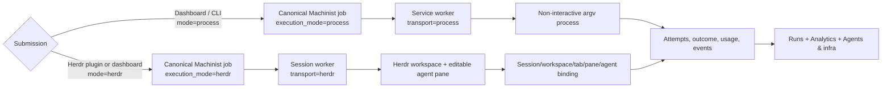

# Herdr interactive integration

Machinist and Herdr have deliberately separate responsibilities:

| Concern | Owner |
| --- | --- |
| Jobs, commands, repositories, routes, retries, budgets, history | Machinist |
| Terminal workspaces, tabs, panes, agent detection, keyboard input | Herdr |
| Mapping between one attempt and one terminal | Machinist attempt record |
| High-frequency tokens, prompt cache, server KV cache, models, DGX health | Existing observability collector and dashboard |

This is not a second job system. Work created in Herdr is submitted to the
Machinist API with `origin=herdr-plugin` and `execution_mode=herdr`, so it
appears immediately in the existing Runs board. Work created in the dashboard
can select **Interactive Herdr terminal** and follows the same path.

## What the operator sees

1. Start or attach to `herdr --session machinist`.
2. Open Herdr’s action menu and select **Machinist: New interactive workflow**.
3. Choose the approved command and repository, optionally enter a model alias,
   paste the task, and finish with a line containing only `.`.
4. The task appears in Machinist. The session-bound worker creates a new Herdr
   workspace rooted at the worker-approved repository.
5. Herdr starts the configured interactive harness in the workspace’s root
   pane. Machinist stores the session, workspace, tab, pane, and agent name on
   the fenced attempt before prompting it.
6. Watch or edit the real terminal. If the agent presents a recognized question
   or approval, Herdr reports `blocked`; Machinist keeps the lease alive while
   waiting for the operator to respond in the pane.
7. When Herdr reports `idle` or `done`, Machinist completes the attempt and keeps
   the workspace open for inspection or a follow-up conversation.

The **Machinist: Task board** action opens a two-second live terminal view. The
web task detail shows the same terminal binding. Machinist stores lifecycle
events, not raw keystrokes.



## Configure harnesses once, with two launch adapters

The headless and interactive commands are separate because most coding CLIs use
different arguments for JSON/print mode and their native TUI.

```toml
[profiles.codex-subscription]
harness = "codex"
provider = "openai"
auth_mode = "subscription"
command = ["codex", "exec", "--ephemeral", "--json", "--model={{machinist.model}}", "--sandbox", "danger-full-access", "-"]
herdr_agent = "codex"
herdr_args = ["--model={{machinist.model}}", "--sandbox", "danger-full-access"]
models = { fast = "gpt-5.6-luna", deep = "gpt-5.6-sol" }

[profiles.claude-subscription]
harness = "claude"
provider = "anthropic"
auth_mode = "subscription"
command = ["claude", "--print", "--verbose", "--output-format", "stream-json", "--model={{machinist.model}}", "--dangerously-skip-permissions"]
herdr_agent = "claude"
herdr_args = ["--model={{machinist.model}}", "--dangerously-skip-permissions"]
models = { fast = "haiku", deep = "sonnet" }
```

Subscription mode uses the CLI’s existing signed-in session in both modes; it
does not convert the run to metered API usage. The harness executable must be
available to the Herdr server’s environment.

### DGX Spark local model through Codex

The Mac mini remains the coding worker. A verified tunnel exposes the DGX model
server on loopback; the agent receives repository access on the Mac, not on the
DGX.

```toml
[profiles.dgx-codex]
harness = "codex"
provider = "openai_compatible"
auth_mode = "local"
base_url = "http://127.0.0.1:18000/v1"
base_url_env = "DGX_SPARK_BASE_URL"
command = ["codex", "exec", "--ephemeral", "--json", "--profile", "dgx-spark", "--model={{machinist.model}}", "--sandbox", "danger-full-access", "-"]
herdr_agent = "codex"
herdr_args = ["--profile", "dgx-spark", "--model={{machinist.model}}", "--sandbox", "danger-full-access"]
models = { local = "ds-0731" }
requires_os = ["darwin"]
requires_arch = ["arm64"]
requires_tags = ["mac-mini", "dgx-client"]
```

The base URL and Machinist metadata are injected into the Herdr workspace. The
profile is advertised only when the operating system, architecture, tags,
executable, and endpoint checks pass.

### DeepSeek and other harnesses

DeepSeek can be a provider behind OpenCode, or a first-class custom harness.
The first form also gives Herdr native agent detection:

```toml
[profiles.deepseek]
harness = "opencode"
provider = "deepseek"
auth_mode = "api_key"
secret_env = "DEEPSEEK_API_KEY"
command = ["opencode", "run", "--model={{machinist.model}}"]
herdr_agent = "opencode"
herdr_args = ["--model={{machinist.model}}"]
models = { reasoner = "deepseek/deepseek-reasoner", chat = "deepseek/deepseek-chat" }
```

`DEEPSEEK_API_KEY` must be present in the environment that starts the Herdr
session. Machinist advertises only the variable name; it never stores or sends
the secret through the control plane.

Any bounded Machinist harness identifier still works in process mode. Interactive
mode additionally requires a `herdr_agent` kind supported by the installed
Herdr version, because Herdr must recognize lifecycle and blocked states.

## Install and operate

```sh
go build -o ./bin/machinist ./cmd/machinist
MACHINIST_BINARY="$PWD/bin/machinist" scripts/setup-macos.sh
herdr plugin link "$PWD/plugins/herdr-machinist" --enabled
herdr --session machinist
```

The plugin startup hook launches one detached `machinist worker start
--transport herdr` only in the named `machinist` session. The normal macOS or
systemd service keeps using the default `process` transport. If the plugin is
linked while the session is already running, invoke **Machinist: Restart
interactive worker** once.

The plugin has distinct POSIX shell and PowerShell entrypoints. Machinist’s
normal environment manifest continues to detect `darwin`, `linux`, or `windows`
and `arm64` or `amd64`, while profile `requires_*` fields decide which adapters
the host advertises. Herdr’s Windows support is currently preview; use the
Windows action names ending in “Windows” on that platform.

## Failure and recovery behavior

- A stopped Herdr session makes its worker disconnected; interactive jobs stay
  queued and are never claimed by the process worker.
- A lost worker lease records an abandoned fenced attempt. Existing route and
  token rules decide whether another attempt may start.
- Cancelling a running interactive job sends `Ctrl-C` to the named Herdr agent
  and completes the Machinist attempt as cancelled.
- A terminal remains open after success or failure. Further manual conversation
  is intentionally outside the completed Machinist attempt unless submitted as
  a new workflow.
- The integration never closes a workspace it did not create and never records
  raw keystrokes.
