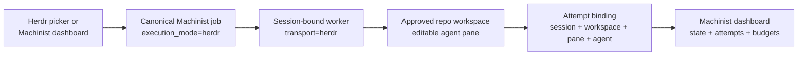

# Machinist for Herdr

This plugin makes Herdr the interactive terminal surface for Machinist while
Machinist remains the source of truth for job state, routing, retries, and
history.

## What it adds

- **Machinist: New interactive workflow** opens a picker for the approved
  command, repository, model alias, and task prompt.
- **Machinist: Task board** opens a live split showing Herdr jobs and their
  session/workspace/agent binding.
- **Machinist: Restart interactive worker** restarts only the worker attached to
  the current persistent Herdr session.
- A startup hook runs a session-bound interactive worker. It can claim only
  `herdr` jobs; the normal service worker can claim only `process` jobs.

Agent terminals are ordinary editable Herdr panes. You can type commands,
answer agent questions, approve work, or continue the conversation. Machinist
records lifecycle metadata and the terminal binding, but never records raw
keystrokes or copies the terminal transcript into the job database.

## Prerequisites

- Herdr 0.8.0 or newer.
- A running Machinist control plane.
- `~/.machinist/worker.toml` with at least one approved repository and one
  executor or profile that defines `herdr_agent` and `herdr_args`.
- The corresponding agent CLI available to the Herdr server environment.

For example, a Codex subscription profile can use the existing signed-in CLI
session in both headless and interactive modes:

```toml
[profiles.codex-subscription]
harness = "codex"
provider = "openai"
auth_mode = "subscription"
command = ["codex", "exec", "--ephemeral", "--json", "--model={{machinist.model}}", "-"]
herdr_agent = "codex"
herdr_args = ["--model={{machinist.model}}", "--sandbox", "danger-full-access"]
models = { deep = "gpt-5.6-sol", fast = "gpt-5.6-luna" }
```

The process `command` and interactive `herdr_args` are deliberately separate:
each harness can use its native headless and terminal invocation without shell
wrappers.

## Install

The macOS deployment script links and enables the plugin automatically when
Herdr is installed. For a development checkout or manual installation:

```sh
herdr plugin link ./plugins/herdr-machinist --enabled
```

The plugin is linked to this checkout, so code changes are picked up without
copying the plugin into a second directory.

## Start and use it

```sh
herdr --session machinist
```

The startup hook intentionally activates only in the dedicated `machinist`
session. It leaves a default or unrelated Herdr session untouched.

1. Open Herdr's action menu and choose **Machinist: New interactive workflow**.
2. Select a command and registered repository.
3. Enter a configured model alias or leave it blank for the profile default.
4. Paste the task and finish with a line containing only `.`.
5. Watch or interact with the agent in the created repository workspace.
6. Use **Machinist: Task board** or the web dashboard to follow the durable run.

Jobs submitted from the Machinist dashboard with **Interactive Herdr terminal**
selected use the same queue. They wait safely until this session-bound worker
is online.

## How a run is connected



The terminal binding is lease-fenced: a stale or replaced attempt cannot attach
its pane to the current run or overwrite the current result.

## Harnesses and platforms

Herdr starts the configured native agent kind. Machinist currently documents
Codex, Claude Code, and OpenCode/DeepSeek examples, while the adapter fields are
configurable for additional Herdr-supported agents. Subscription sessions,
API-key providers, and local/DGX model endpoints remain worker-local.

The manifest supplies POSIX entrypoints for macOS/Linux and PowerShell
entrypoints for Windows. Machinist's normal environment requirements still
decide whether a profile is compatible with the host OS, architecture, tags,
executable set, and endpoint health.

## Troubleshooting

- **Job remains queued:** open `herdr --session machinist`, then confirm the
  Workers page shows a connected worker with the `herdr` transport.
- **Profile is missing:** run `machinist worker validate`; confirm the profile
  has both `herdr_agent` and `herdr_args` and passes its environment checks.
- **Plugin linked after Herdr was already running:** choose **Machinist: Restart
  interactive worker** once.
- **Agent CLI is not found:** ensure the executable is on the PATH inherited by
  the Herdr server, not only an unrelated login shell.

See the full [Herdr integration guide](../../docs/herdr.md) for DGX-local
profiles, DeepSeek/OpenCode, lifecycle behavior, security boundaries, and
platform-specific operation.
