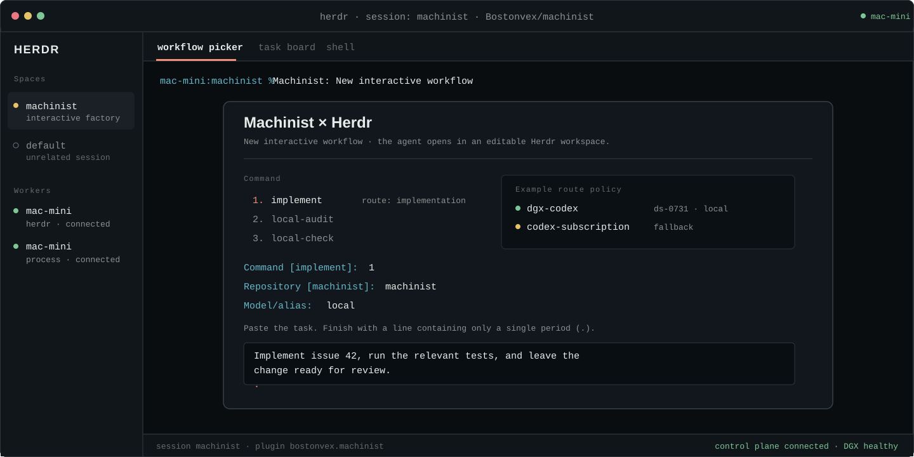
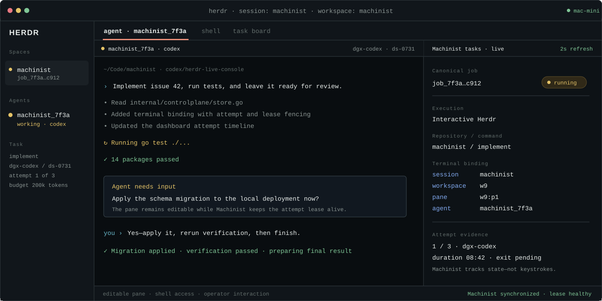
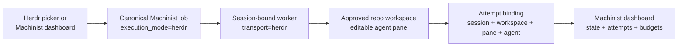

# Machinist for Herdr

This plugin makes Herdr the interactive terminal surface for Machinist while
Machinist remains the source of truth for job state, routing, retries, and
history.

## What it adds

- **Machinist: New interactive workflow** opens a picker for the approved
  command, repository, model alias, and task prompt.
- **Machinist: Task board** opens a live split showing Herdr jobs and their
  session/workspace/agent binding.
- **Machinist: Restart interactive worker** restarts only the worker attached to
  the current persistent Herdr session.
- A startup hook runs a session-bound interactive worker. It can claim only
  `herdr` jobs; the normal service worker can claim only `process` jobs.
- Named sessions can be pinned to separate worker configurations, so each
  session advertises only its intended harness or local model profile.

Agent terminals are ordinary editable Herdr panes. You can type commands,
answer agent questions, approve work, or continue the conversation. Machinist
records lifecycle metadata and the terminal binding, but never records raw
keystrokes or copies the terminal transcript into the job database.

## Prerequisites

- Herdr 0.8.0 or newer.
- A running Machinist control plane.
- `~/.machinist/worker.toml` with at least one approved repository and one
  executor or profile that defines either `herdr_agent`/`herdr_args` or a
  self-reporting `herdr_command`.
- The corresponding agent CLI available to the Herdr server environment.

For example, a Codex subscription profile can use the existing signed-in CLI
session in both headless and interactive modes:

```toml
[profiles.codex-subscription]
harness = "codex"
provider = "openai"
auth_mode = "subscription"
command = ["codex", "exec", "--ephemeral", "--json", "--model={{machinist.model}}", "-"]
herdr_agent = "codex"
herdr_args = ["--model={{machinist.model}}", "--sandbox", "danger-full-access"]
models = { deep = "gpt-5.6-sol", fast = "gpt-5.6-luna" }
```

The process and interactive launch adapters are deliberately separate: each
harness can use its native headless and terminal invocation. DeepCode needs a
thin wrapper only because its headless prompt is an argument while Machinist
delivers prompts over standard input.

## Install

The macOS deployment script links and enables the plugin automatically when
Herdr is installed. For a development checkout or manual installation:

```sh
herdr plugin link ./plugins/herdr-machinist --enabled
```

The plugin is linked to this checkout, so code changes are picked up without
copying the plugin into a second directory.

## Start and use it

```sh
herdr --session machinist
```

The startup hook intentionally activates only in the dedicated `machinist`
session by default. It also activates a named session when
`~/.machinist/herdr-sessions/<session>.toml` exists. That file is a normal
worker configuration and should contain only the profile or executor that the
session is allowed to run. A session without a matching file remains untouched.

For example, provision `claude.toml`, `codex.toml`, and `deepseek.toml`, each
with a unique worker `name` and `data_directory`, then launch:

```sh
herdr --session claude
herdr --session codex
herdr --session deepseek
```

The DeepSeek session uses
[`lessweb/deepcode-cli`](https://github.com/lessweb/deepcode-cli), a dedicated
DeepSeek coding harness, not Codex. DeepCode 0.3.1 provides both an interactive
TUI and `--exec` mode and accepts an OpenAI-compatible local endpoint. Install
and pin it on the Mac mini:

```sh
npm install --global @vegamo/deepcode-cli@0.3.1
deepcode --version
```

Configure the worker with the repository's process and Herdr wrappers:

```toml
[profiles.dgx-deepcode]
harness = "deepcode"
provider = "openai_compatible"
auth_mode = "local"
base_url = "http://127.0.0.1:18000/v1"
base_url_env = "DEEPCODE_BASE_URL"
command = ["/absolute/path/to/machinist/plugins/herdr-machinist/scripts/run-deepcode.sh", "--model={{machinist.model}}"]
herdr_command = ["/absolute/path/to/machinist/plugins/herdr-machinist/scripts/run-deepcode-herdr.sh", "--model={{machinist.model}}"]
models = { local = "ds-0731" }
requires_executables = ["deepcode", "node"]
requires_os = ["darwin"]
requires_arch = ["arm64"]
requires_tags = ["mac-mini", "dgx-client"]
```

The wrappers do not implement a coding agent. They translate prompt transport,
copy DeepCode's reported token total into Machinist's run record, and map
DeepCode's persisted `processing`, `ask_permission`, `waiting_for_user`, and
settled states to Herdr. Set `DEEPCODE_TELEMETRY_ENABLED=0` for a local-only
deployment. The `local` API key used by the wrapper is a non-secret
compatibility value for the unauthenticated loopback endpoint.

1. Open Herdr's action menu and choose **Machinist: New interactive workflow**.
2. Select a command and registered repository.
3. Enter a configured model alias or leave it blank for the profile default.
4. Paste the task and finish with a line containing only `.`.
5. Watch or interact with the agent in the created repository workspace.
6. Use **Machinist: Task board** or the web dashboard to follow the durable run.

Jobs submitted from the Machinist dashboard with **Interactive Herdr terminal**
selected use the same queue. They wait safely until this session-bound worker
is online.

## Example walkthrough

This example dispatches the `implement` command for the registered `machinist`
repository. The `local` alias resolves on the worker to the DGX-backed model;
the control plane never receives the model endpoint or subscription credentials.

<p align="center">
  
</p>

After dispatch, Herdr owns the editable terminal and Machinist owns the durable
job. An operator can answer a blocking question in the pane while the task board
shows the attempt's exact session, workspace, pane, and agent IDs.

<p align="center">
  
</p>

These are scalable vector walkthroughs of the implemented interaction model,
not captured production data. Repository names, IDs, timings, and prompts are
examples.

## How a run is connected



The terminal binding is lease-fenced: a stale or replaced attempt cannot attach
its pane to the current run or overwrite the current result.

## Harnesses and platforms

Herdr starts a configured native agent kind or a self-reporting command.
Machinist currently documents Codex, Claude Code, and DeepCode/DeepSeek
examples, while the adapter fields remain configurable for additional agents.
Subscription sessions, API-key providers, and local/DGX model endpoints remain
worker-local.

The manifest supplies POSIX entrypoints for macOS/Linux and PowerShell
entrypoints for Windows. Machinist's normal environment requirements still
decide whether a profile is compatible with the host OS, architecture, tags,
executable set, and endpoint health.

## Troubleshooting

- **Job remains queued:** open `herdr --session machinist`, then confirm the
  Workers page shows a connected worker with the `herdr` transport.
- **Profile is missing:** run `machinist worker validate`; confirm the profile
  has a native `herdr_agent` or a self-reporting `herdr_command` and passes its
  environment checks.
- **Plugin linked after Herdr was already running:** choose **Machinist: Restart
  interactive worker** once.
- **Agent CLI is not found:** ensure the executable is on the PATH inherited by
  the Herdr server, not only an unrelated login shell.

See the full [Herdr integration guide](../../docs/herdr.md) for the DeepCode DGX
profile, lifecycle behavior, security boundaries, and platform-specific
operation.
